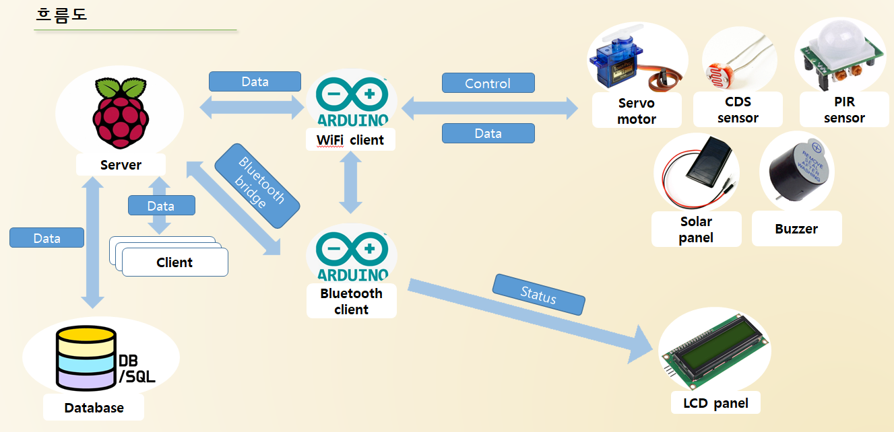
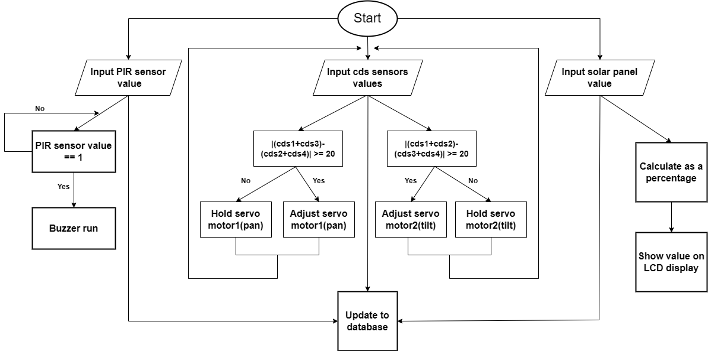

# Solar_tracking_system
## 프로젝트 목적
태양광패널이 태양광을 추적하도록하여 발전효율을 향상시키고자 했습니다.  
이 프로젝트에서는 태양이 어디로 이동하던 실시간으로 추적할 수 있도록 하는것을 목표로 했습니다.  
이는 드론이나 자동차등 이동형 모빌리티에 사용될 수 있습니다.
## 사용 디바이스
라즈베리파이, 아두이노2개(wifi, bluetooth), 조도센서, 서보모터, 태양광패널, 인체감지센서, 부저, LCD패널, 블루투스 모듈, 와이파이 모듈
## 개발환경
arduino ide, raspberry pi os(linux)
## 흐름도

## High Level Design

## 시연영상
### auto mode

원본영상(이 링크의 raw file 다운로드시 좀 더 크고 명확한 영상을 확인하실 수 있습니다. ) :
[auto](https://github.com/BrotherHwan/Solar_tracking_system/blob/main/image_video/solar_tracking_auto.mp4)

### manual mode - 유사시에 원하는 각도로 직접 조절. 마지막에는 다시 auto모드를 켜는 모습.

원본영상 :
[manual](https://github.com/BrotherHwan/Solar_tracking_system/blob/main/image_video/solar_tracking_manual.mp4)

